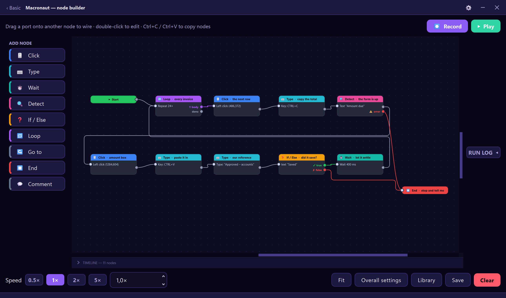
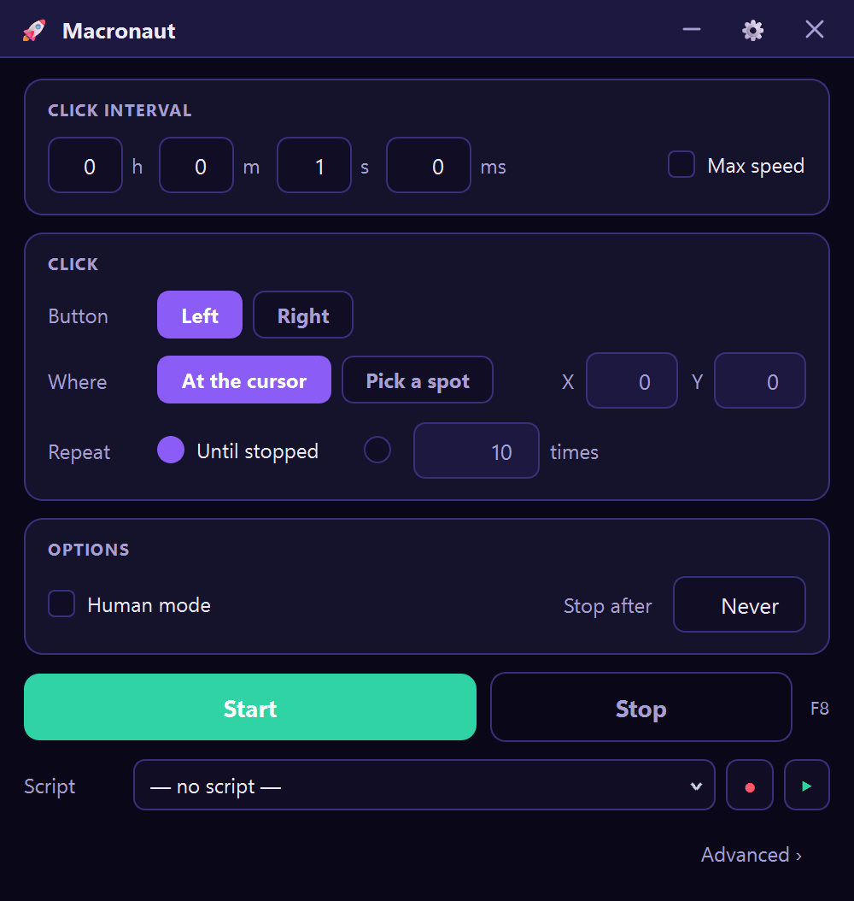

# Macronaut

**An auto clicker that watches the screen and decides what to do.**
Free and open source, for Windows. Wait for something to appear, click it where
it actually is, and keep going when it doesn't — without writing code.

[](https://github.com/gtjevptje/macronaut-source/actions/workflows/tests.yml)
[](LICENSE)
[](#installation)
[](https://github.com/gtjevptje/Macronaut/releases/latest/download/Macronaut.exe)

<p align="center">
  
</p>

<p align="center"><em>Every step is a box. Drag a port onto another box to wire
them together — that is the whole language.</em></p>

## Download

### → **[Macronaut.exe](https://github.com/gtjevptje/Macronaut/releases/latest/download/Macronaut.exe)**

Windows 10 or 11. One file, no installer, no account, nothing to configure — run
it and it works. **[macronaut's website](https://gtjevptje.github.io/Macronaut/)**
has screenshots, the full feature list and a published SHA-256 of that download,
plus a [click speed test](https://gtjevptje.github.io/Macronaut/click-speed-test.html)
and how it compares to
[AutoHotkey](https://gtjevptje.github.io/Macronaut/autohotkey-alternative.html)
and [TinyTask](https://gtjevptje.github.io/Macronaut/tinytask-alternative.html).

⚠ **Windows will warn you the first time.** A blue "Windows protected your PC"
box appears — click **More info** → **Run anyway**. That warning is not about
anything found in the file; it is what Windows shows for any executable without
a code-signing certificate, which this project does not have yet. Being
able to read the source instead is the honest answer to it, and that is what
this repository is. Your antivirus may flag it for the same reason, plus one
more: it installs a global keyboard hook, because a stop hotkey that only works
when the window is focused would be useless.

To run from source instead, see [Installation](#installation) below.

---

## What it does that a plain auto clicker cannot

**It waits for something, then clicks where that thing actually is.** Point it
at a button, a dialog or an icon, and it searches the screen until that appears
— at a different DPI or window size too — then clicks it where it found it, not
at a coordinate that was right yesterday. Text works the same way, read with
Windows' own OCR, and so does a single pixel changing colour.

**It decides.** Every detection has a *found* branch and a *not found* branch,
so a script can handle the dialog that never appeared instead of hammering the
spot where it should have been. Loops, jumps and variables go with it.

**Keyboard and mouse in one script.** Clicks, keystrokes, chords, drags, scroll
flicks and held keys in whatever order you need — hold **W** to keep moving
while the mouse clicks. Anything held is released when the run ends, stops or
crashes.

**It reaches programs that ignore ordinary input.** Three selectable input
backends: standard, SendInput scancodes, and the **Interception** kernel driver.
Many games discard injected input; the lower two look like a real keyboard.

**And it is all free.** No account, no advertising, no trial and no limit on
what a script can do.

---

## Features

<p align="center">
  
</p>

<p align="center"><em>The canvas is behind an <strong>Advanced</strong> link.
This is what opens if all you wanted was an auto clicker.</em></p>

### Basic clicking
- Left or right mouse button
- Click at the current cursor position or a fixed coordinate (3-second eyedropper capture)
- Adjustable click interval with millisecond precision, down to 5 ms
- Optional interval randomisation (±N ms) to vary the rhythm
- Run until stopped, or stop after N clicks or N seconds
- Optional countdown delay before clicking starts
- Human mode: jitters the cursor and the timing so the rhythm is not machine-perfect

The **Click** step on the canvas adds the rest: the middle button, double-click
and hold-down with an adjustable hold duration.

### Script builder
- Record live mouse clicks and keystrokes into a replayable script
  - Modifier chords (e.g. **Ctrl+C**) are captured as a single combo step
  - Rapid same-spot clicks are merged into a double-click step
- Nine-node palette — **Click**, **Type**, **Wait**, **Detect**, **If / Else**,
  **Loop**, **Go to**, **End**, **Comment** — click one to add it, or drag it onto
  the canvas to place it
- **Drag nodes anywhere on the canvas** — the order comes from the wires between them
- **Edit**, **Name**, **Duplicate** (Ctrl+D) and **copy / paste** (Ctrl+C / Ctrl+V) from the right-click menu
- Double-click a node to edit it; double-click a wire to put a bend in, and the
  bend again to take it out. Per-node delay captured on record or set manually
- **Timeline strip** under the canvas: one box per node in run order, widths
  proportional to how long each takes — exact where a setting decides it,
  measured once this machine has timed it, an outlined ceiling for a Detect's
  timeout, hatched where nothing is known yet. A key held down shows as a bar
  spanning every node it is held across, so an unreleased key is visible before
  you press Play
- Save and load scripts to / from JSON files
- Loop a set number of times or infinitely, with **0.5× / 1× / 2× / 5×** presets and a
  custom playback speed from 0.1× to 50×
- Keyboard shortcuts: **Del** delete · **Ctrl+D** duplicate · **Ctrl+C/V** copy/paste

### Hotkeys & triggers
- A single global hotkey (default **F8**, configurable) starts / stops from anywhere —
  the START/STOP button and tray menu always show the currently bound key
- Holding the hotkey fires once, not repeatedly (no start/stop flicker)
- Optional second "trigger" key that also starts/stops
- **Image trigger** (Basic face): wait until a target screenshot appears on screen before
  clicking begins (requires `opencv-python`; the option is disabled with a note if it isn't installed)
- **Wait-for-Image** step (in the builder): pause until an image appears, then optionally click it

### Smart features
- **Human mode** (Basic face): randomised intervals and a few pixels of cursor jitter per click
- **Click region constraint**: draw a bounding box on screen; clicks stay inside it
- **Auto-pause on focus loss**: pause automatically when your chosen window isn't focused (needs `pywin32`)
- **Key blacklist**: any key listed here is never sent during script playback — a safety net for keys like Win or Alt+F4

### Interface
- Two faces — **Basic** and **Advanced** — switched with the **Advanced ›** and
  **‹ Basic** links; **Settings** and **Stats** live behind the gear. The app
  reopens on whichever face you used last
- Responsive layout that adapts to small / non-maximised windows
- Context-aware fields — only the inputs relevant to your current selection stay enabled
- Live click counter, keystroke counter, elapsed time, and CPS in the status bar
- System-tray icon with Start / Stop / Show / Quit menu and a colour state (indigo = idle, green = running)
- Closing the window **fully quits** the app — the global hotkey hook and any running automation are stopped, so nothing lingers in the background
- Instant dark / light theme toggle in Settings — no restart

### Stats & logging
- Rolling CPS and KPS display (5-second window)
- Per-session history (start, end, duration, clicks, keys, averages),
  **saved between runs** in `~/.macronaut/sessions.json`
- Export session history to CSV

---

## About this repository

This is the complete source of Macronaut, published under the GPL. Everything
that goes into the released `.exe` is here, and `pyinstaller macronaut.spec`
builds it.

⚠ It will not be the *same file*. PyInstaller writes a timestamp into the
executable and does not order its archive deterministically, so two builds from
this same tree, on this same machine, minutes apart, differ in tens of millions
of bytes and a few kilobytes of length. That is PyInstaller, not something
hidden here — but it means a hash comparison against the published download will
never match, and you should not read that as evidence of anything. What is
checkable is the source, all of which is in this repository.

The commit history starts on the day the project went open source rather than
on the day it began. The private working repository also holds the business
around the program — outreach drafts and traffic numbers — none of
which is part of Macronaut, and rewriting three years of history to strip it was
a worse risk than simply starting here. Nothing about the *program* is withheld.

Issues and pull requests are welcome. It is a one-person project, so replies
are not instant. [CONTRIBUTING.md](CONTRIBUTING.md) covers getting set up,
running the suite, and the three traps that have actually caught people.
Security bugs go to email rather than the issue tracker —
[SECURITY.md](SECURITY.md) says what is in scope and, just as usefully, what is
not.

---

## Installation

### Prerequisites
- Python 3.9+ (64-bit recommended on Windows)
- Windows 10 / 11

### Install dependencies

```powershell
cd Macronaut
pip install -r requirements.txt
```

> `opencv-python` is only needed for the image-matching features (image trigger and
> Wait-for-Image with confidence matching). Without it, those options are disabled
> automatically and everything else works normally.

### Run

```powershell
python main.py
```

---

## Building a standalone .exe

```powershell
pip install pyinstaller
pyinstaller macronaut.spec
```

The output `Macronaut.exe` will be in `dist/`. It bundles all dependencies and
requires no Python installation to run. To brand the executable, run
`python create_shortcut.py` once to generate `assets/icon.ico`, then uncomment the
`icon=` line in `macronaut.spec`.

---

## Quick-start guide

1. **Scripts** — open the builder with **Advanced ›**. Click **⏺ Record** to capture
   live input, or use the left-hand palette to add nodes. Drag nodes to arrange them and
   wire them together for order, then press **▶ Play**.
2. **Basic clicking** — go back with **‹ Basic**, set button / action / interval / position,
   then click **START** (or press **F8**).
3. **Fixed position** — choose *A fixed point on screen*, click **Pick a point on screen**,
   and hover the target; the position is captured after a 3-second countdown.
4. **Hotkey** — default is **F8** and works even when minimised. Change it in
   **Settings → Hotkeys**; the button and tray labels update to match.
5. **Human mode** — enable on the **Basic** face to add timing variation and cursor jitter.
6. **Region constraint** — in **Settings**, click *Select region on screen…* and drag a rectangle.
7. **Image trigger** — on the **Basic** face, tick *Only start once a target image is on screen*,
   then browse to or capture a PNG/JPEG template.

---

## File structure

```
Macronaut/
├── main.py          Entry point, both UI faces, single global hotkey listener
├── clicker.py       Mouse click automation engine (QThread worker)
├── keystrokes.py    Key-name tables and conversion/display helpers
├── recorder.py      Live script recorder and playback engine
├── settings.py      Persistent JSON settings (stored in ~/.macronaut/)
├── stats.py         CPS/KPS tracking and persistent session history
├── tray.py          System-tray icon
├── requirements.txt Python dependencies
├── macronaut.spec   PyInstaller build configuration
└── assets/          icon.ico for the branded .exe
```

---

## Troubleshooting

| Problem | Fix |
|---|---|
| Hotkey not triggering | Run as administrator; some games/apps block low-level key hooks |
| Image trigger greyed out | Install OpenCV: `pip install opencv-python` |
| Image not found | Lower the confidence below 0.8; capture the template at the same DPI |
| Window focus detection not working | Install `pywin32` (`pip install pywin32`) |
| App freezes on start | Check Windows Defender / antivirus — pynput hooks can be flagged |

---

## Licence

**Macronaut is free software, under the GNU General Public License v3.0 or
later.** Copyright © 2026 Gerben van Poucke.

`SPDX-License-Identifier: GPL-3.0-or-later`

The full text is in [LICENSE](LICENSE). The components Macronaut is built on,
and their own terms, are in
[THIRD-PARTY-NOTICES.md](THIRD-PARTY-NOTICES.md).

Run it, read it, change it, pass it on. The one obligation: if you distribute a
modified version — as source or as a built `.exe` — you publish your changes
under the same licence. Nobody gets to take this, close it, and sell it back.

### Why it was opened

Macronaut was proprietary until 30 August 2026. It was opened because the most
common reason people gave for not downloading it was that they could not see
what they were running, which is an entirely fair thing to say about an
unsigned executable that installs a global keyboard hook and asks to be trusted
with your mouse. Every other answer to that objection asks for trust. This one
does not: the code is here, and `pyinstaller macronaut.spec` builds the program
from it.

Builds published before that date remain under the EULA they shipped with.
Everything from here is GPL.

### There is no warranty

Sections 15 and 16 of the licence say this in the legal register. Plainly:
Macronaut sends real keyboard and mouse input, and it is given to you as-is.
Many online games and services forbid automation in their terms of service, and
using it against them can cost you your account. That is your call to make —
read their rules first.

